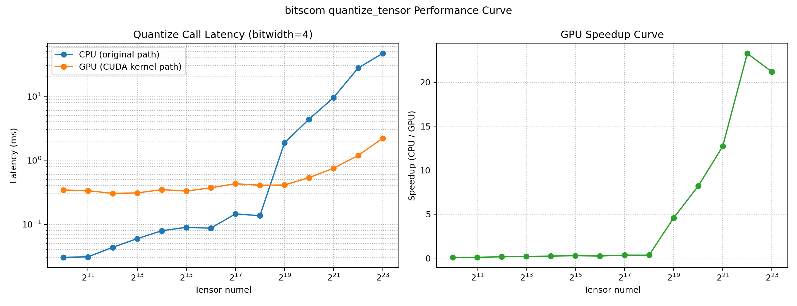
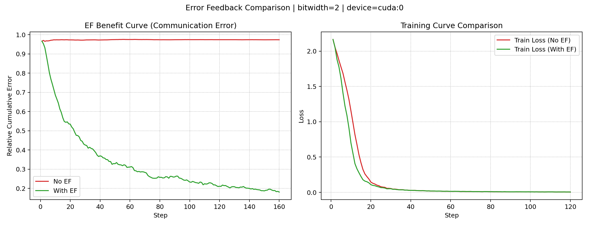
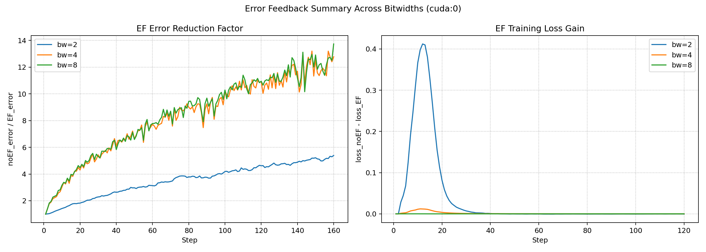

# bitscom

bitscom is a low-bit distributed communication library for PyTorch.
It provides:

- A custom `torch.distributed` backend named `lowbit`
- A Python wrapper API `LowBitGroup`
- A Python fallback quantization/bit-packing module for development and tests

## What This Repository Does

Core objective:

- Reduce communication traffic in distributed training by sending quantized low-bit representations instead of full-precision tensors.

Current architecture:

- C++ backend (`ProcessGroupLowBit`) wraps NCCL process group calls.
- Python API (`bitscom.LowBitGroup`) exposes collective operations.
- Python quantization module (`bitscom.quantization`) provides functional compression/decompression logic that can be tested without GPUs.

## Implemented Features

- Supported quantization bitwidths: `1, 2, 4, 8, 12, 16`
- Tensor quantize/dequantize utilities
- Bit-packing and unpacking for the supported bitwidths
- CUDA quantization/pack/unpack fast path for `1/2/4/8` bit
- Stochastic rounding support in quantization (CPU + CUDA)
- `LowBitGroup.compress()` and `LowBitGroup.decompress()` helper APIs
- Optional simulation mode (`simulate_quantization=True`) for validating quantization effect before collectives
- Python low-bit all-reduce pipeline for `<8bit` (`all-to-all -> local reduce -> all-gather`)
- Hierarchical pipeline-A low-bit all-reduce (`local reduce -> inter lowbit all-reduce -> local broadcast`)
- Multi-node CUDA dual-stream scheduling for pipeline-A (`warmup -> steady -> cooldown`)
- Single-node local-group-only fast path: one-shot full-precision all-reduce without chunked pipeline
- Error-feedback in first-stage quantization for C++ backend low-bit allreduce path
- Explicit backend option registration: `bitwidth` and `error_feedback`
- Robust backend registration with explicit error when C++ extension is missing
- Build-time `compile_commands.json` emission for clangd

## Gaps That Still Remain

The following items are still pending and marked as future work:

- In-backend low-bit paths for `allgather` and `reduce_scatter` (currently forwarded to NCCL)
- End-to-end multi-node benchmark suite and scaling analysis
- Stronger C++/Python path unification to reduce duplicated quantization logic

## Environment Setup (Before Build)

The extension build depends on a working Python + PyTorch + CUDA toolchain.

1. Create and activate a clean conda env:

```bash
conda create -n bitscom python=3.12 -y
conda activate bitscom
```

2. Install base build tools:

```bash
python -m pip install --upgrade pip setuptools wheel
```

3. Install PyTorch with CUDA support (example: CUDA 13.0 wheels):

```bash
python -m pip install torch --index-url https://download.pytorch.org/whl/cu130
```

4. Optional: if CUDA/NCCL are not in default locations, export paths:

```bash
export CUDA_HOME=/usr/local/cuda
export NCCL_INCLUDE_DIR=/path/to/nccl/include
export NCCL_LIB_DIR=/path/to/nccl/lib
```

5. Quick sanity checks before building:

```bash
python -c "import torch; print(torch.__version__, torch.version.cuda)"
nvcc --version
```

## Build

Editable install (recommended for development):

```bash
pip install -e .
```

If using the tested conda environment in this repo:

```bash
/home/aerith/miniforge3/envs/bitscom/bin/python -m pip install -e . --no-build-isolation
```

The extension build now emits `compile_commands.json` at repo root for clangd.

## Test

Unit tests and non-distributed integration-safe tests:

```bash
pytest -q
```

Quantization-focused tests (including CUDA path and stochastic rounding checks):

```bash
/home/aerith/miniforge3/envs/bitscom/bin/python -m pytest -q tests/test_quantization.py
```

Pipeline-A API behavior tests:

```bash
/home/aerith/miniforge3/envs/bitscom/bin/python -m pytest -q tests/test_api.py
```

Distributed correctness test for pipeline-A (NCCL, 2+ GPUs):

```bash
BITSCOM_RUN_DIST=1 /home/aerith/miniforge3/envs/bitscom/bin/python -m pytest -q tests/test_pipeline_a_correctness.py
```

Run integration/e2e with distributed launcher:

```bash
torchrun --nproc_per_node=2 tests/test_e2e.py
```

Run single-GPU end-to-end training tests (no multi-GPU required):

```bash
/home/aerith/miniforge3/envs/bitscom/bin/python -m pytest -q tests/test_single_gpu_train_e2e.py
```

The single-GPU e2e test prints performance metrics:

- `avg_step_time_ms`
- `throughput_samples_per_s`
- `peak_memory_mb`

To run the CIFAR10 small-step variant (10 steps), allow dataset download:

```bash
BITSCOM_ALLOW_DOWNLOAD=1 /home/aerith/miniforge3/envs/bitscom/bin/python -m pytest -q tests/test_single_gpu_train_e2e.py -k cifar10
```

## Performance Test

Performance tests are included but disabled by default to keep CI stable.

```bash
BITSCOM_RUN_PERF=1 pytest -q -m performance
```

### Quantization CPU vs GPU Curve

Generate a latency/speedup curve for `quantize_tensor` (CPU original path vs CUDA path):

```bash
/home/aerith/miniforge3/envs/bitscom/bin/python benchmarks/quantize_perf_curve.py --bitwidth 4 --min-pow2 10 --max-pow2 23
```

Outputs:

- `benchmarks/outputs/quantize_curve_bw4.csv`
- `benchmarks/outputs/quantize_curve_bw4.png`

Preview:



### Error-Feedback Curve (Single Bitwidth)

Generate communication-error and training-loss comparison curves for EF vs no-EF:

```bash
/home/aerith/miniforge3/envs/bitscom/bin/python benchmarks/error_feedback_comparison.py --bitwidth 2 --steps 180 --train-steps 140 --vec-size 524288 --batch-size 256 --device cuda:0
```

Outputs:

- `benchmarks/outputs/ef_benefit_curve_bw2.csv`
- `benchmarks/outputs/ef_training_curve_bw2.csv`
- `benchmarks/outputs/ef_comparison_bw2.png`

Preview:



### Error-Feedback Summary (Multi-Bitwidth)

Generate one summary figure across multiple bitwidths (default `2/4/8`):

```bash
/home/aerith/miniforge3/envs/bitscom/bin/python benchmarks/error_feedback_multibw.py --bitwidths 2 4 8 --device cuda:0 --steps 160 --train-steps 120 --vec-size 524288 --batch-size 256
```

Key output:

- `benchmarks/outputs/ef_multibitwidth_summary.png`

Preview:



### E2E Loss Curve: Stochastic Rounding vs No Stochastic Rounding

Generate end-to-end distributed training loss curves comparing:

- `stochastic_rounding=False`
- `stochastic_rounding=True`
- no-compression baseline (full-precision all-reduce path)

Run (2 GPUs):

```bash
torchrun --nproc_per_node=2 benchmarks/stochastic_rounding_e2e_curve.py --bitwidth 4 --steps 160 --batch-size 128
```

Outputs:

- `benchmarks/outputs/e2e_loss_curve_stochastic_vs_nocompress_bw4.csv`
- `benchmarks/outputs/e2e_loss_curve_stochastic_vs_nocompress_bw4.png`

### Multi-Model E2E Comparison (ResNet50 / BERT / GPT-2)

Run distributed end-to-end comparisons across multiple model families:

- lowbit without stochastic rounding
- lowbit with stochastic rounding
- no-compression baseline

Example (2 GPUs):

```bash
torchrun --nproc_per_node=2 benchmarks/multimodel_stochastic_e2e_curve.py --models resnet50 bert gpt2 --bitwidth 4 --steps 80 --batch-size 8 --dataset-size 512
```

Per-model outputs:

- `benchmarks/outputs/multimodel_resnet50_loss_curve_bw4.csv`
- `benchmarks/outputs/multimodel_resnet50_loss_curve_bw4.png`
- `benchmarks/outputs/multimodel_bert_loss_curve_bw4.csv`
- `benchmarks/outputs/multimodel_bert_loss_curve_bw4.png`
- `benchmarks/outputs/multimodel_gpt2_loss_curve_bw4.csv`
- `benchmarks/outputs/multimodel_gpt2_loss_curve_bw4.png`

## Backend Registration Options

Use explicit backend options when registering:

```python
import bitscom

# Register lowbit backend with explicit options.
bitscom.init(bitwidth=4, error_feedback=True)
```

Notes:

- `error_feedback=True` currently applies to first-stage quantization in low-bit allreduce.
- Re-registering backend with different options in the same process raises an error by design.

## Hierarchical All-Reduce Options

When using hierarchical pipeline-A in Python (`local_group` + `inter_group`),
you can control whether local-group communication is quantized:

```python
group.all_reduce(
	tensor,
	local_group=local_group,
	inter_group=inter_group,
	chunk_size=1 << 20,
	local_quantize=False,  # default: local full precision, inter lowbit
)
```

Set `local_quantize=True` to keep the original behavior where local-group and
inter-group stages are both quantized.

## Project Layout

- `cpp/`: C++ backend and bindings
- `python/bitscom/`: Python package
- `tests/`: unit tests, integration tests, and performance tests
